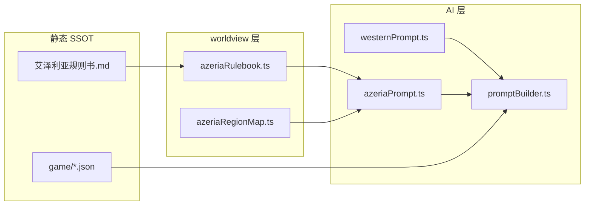

# 西幻万人迷 v2 · 艾泽利亚规则书接入方案

> **状态**：第二轮 v0.2  
> **世界观 SSOT**：[`艾泽利亚大陆_女本位冒险规则书.md`](./艾泽利亚大陆_女本位冒险规则书.md)  
> **策略**：规则书为 AI 规制核心 + 独立「规则书」Tab；可删改旧艾尔茜利恩文案；沉浸对话保留

---

## 0. 定位

| 项 | 说明 |
|----|------|
| 产品 | 西幻万人迷 v2（`western-allure`） |
| 新增世界观 | **艾泽利亚大陆** · 女本位冒险 D20 沙盒 |
| 与艾尔茜利恩关系 | **双轨并存**：Aetherion 场域/UI 保留；艾泽利亚规则通过 prompt 与数据层**叠加** |
| 工作目录 | 仅 `西幻万人迷v2/` |
| 原则 | 简洁结构 · 最少测试 · 调试思维（先 prompt 生效，再补 store） |

### 已确认机制

- 规则书 34 章全文作为 SSOT，运行时按章节切片注入 AI
- 现有 8 冒险域 **不删不改**，通过 `azeriaRegionMap` 映射到艾泽利亚八大区域
- 现有轻养成四维、身体面板、骰子 UI **保留**；艾泽利亚 D20 六维与指令 **新增并行**
- 固定男主 `game/characters/` **保留**；规则书 Ch8 动态 NPC 生成 **叠加**到 `npcGenerator`

---

## 1. 规则书章节 → 引擎模块

| 规则书 | 摘要 | 现有 v2 | 接入策略 |
|--------|------|---------|----------|
| Ch1 世界基石 | 女本位法则、地图、公会、D20、冒险 | `westernPrompt`、dice | `azeriaPrompt` 按场景摘抄 |
| Ch2 装备物品 | 武器护甲药水 | 无 | 规则书引用 + 后续 `$背包` |
| Ch3 玩家设定 | 身份、身体、加点、职业 | Onboarding、bodyStats | **扩展** onboarding 字段（可选） |
| Ch4 种族体系 | 8 种族生理/攻略池 | `races.ts`（7 族） | **补充** `azeriaRaces.ts`，不删 `races.ts` |
| Ch5 养成经营 | 男主养成、身体开发面板 | passport、cultivation | 映射好感→羁绊；堕落→服从度 |
| Ch7 地图流程 | 节点地图、队伍 4 人 | facilities、party | 已有上限 4，prompt 注入 |
| Ch7–8 H/NSFW | 骰子开关、四阶段、词库 | hPhase、bodyStats | **新增** `azeriaDiceMode` 等 UI 开关 |
| Ch8 NPC 生成 | 14 维参数池 | `npcGenerator` | prompt 注入 Ch8.2 维度表 |
| Ch9 指令 | 34 条 `$` 指令 | 仅 `$面板` | **扩展** `commandHandler`（分批） |
| Ch11–13 主线阵营结局 | 女神陨落 | 堕神线伏笔 | 叠加长线 prompt，不替换 |
| Ch14–34 扩展系统 | 仆从、竞技场、声望… | 部分无 | P2+ 按优先级增量 |

---

## 2. 架构（简洁双轨）



**prompt 组装顺序**（只增不改原顺序）：

1. 原 `buildSystemPrompt` 全文  
2. 原 `buildWesternPromptExtras`（艾尔茜利恩）  
3. **新增** `buildAzeriaPromptExtras`（按 facility / hPhase / 开关选章）

---

## 3. 场域映射（8 域 → 艾泽利亚区域）

| v2 facilityId | 艾尔茜利恩名 | 艾泽利亚区域 | 遭遇表 |
|---------------|-------------|-------------|--------|
| solar_sanctum | 日冕圣殿 | 天界浮岛 | Ch1.5.2 天界 |
| void_throne | 虚空王座厅 | 深渊裂谷 | Ch1.5.2 深渊 |
| succubus_office | 魅魔事务署 | 深渊裂谷 | 同上 |
| moonwood | 银弦月林 | 精灵之森 | Ch1.5.2 精灵 |
| drake_crag | 龙脊绝壁 | 永冬雪境 | Ch1.5.2 龙族 |
| tidegate | 汐门礁湾 | 人鱼海域 | Ch1.5.2 人鱼 |
| dice_tavern | 命运骰厅 | 人类诸国 | Ch1.5.2 人类 |
| relic_auction | 圣骸拍卖会 | 人类诸国 | 同上 |

兽人荒野、魔族荒原：自定义遭遇区 / 世界树扩展（P2）。

---

## 4. 分阶段里程碑

| 阶段 | 内容 | 验证方式 |
|------|------|----------|
| **M0** ✅ | SSOT 复制、`INTEGRATION_PLAN`、章节索引 | 构建通过 |
| **M1** | `azeriaPrompt` 注入 + 区域映射 | 进任意域对话，system 含女本位法则摘要 |
| **M2** | 指令：`$骰子` `$粗口` `$公开` `$怀孕` `$投骰` | 聊天输入，系统消息回显状态 |
| **M3** | 规则书阅读器 UI（图鉴/冒险入口） | 可浏览 34 章目录与正文 |
| **M4** | `azeriaRaces.ts` + NPC 14 维 prompt | 随机男主卡字段更贴近规则书 |
| **M5** | `adventureStatsStore` 六维 D20 + `$面板` 扩展 | 与 cultivation 双轨显示 |
| **M6** | 主线/阵营/结局 prompt 块（Ch11–13） | 高好感会话注入裂痕伏笔 |
| **M7** | 仆从、竞技场、声望等（Ch20–22） | 按需 UI |

**测试策略**：每阶段只跑 `npm run build` + 手动 1 条对话 / 1 条指令，不做全量 E2E。

---

## 5. 新增文件清单

```
西幻万人迷v2/
├── 艾泽利亚大陆_女本位冒险规则书.md    # SSOT（已复制）
├── INTEGRATION_PLAN.md                 # 本文件
├── game/worlds/azeria.json             # 艾泽利亚世界书摘要（补充，不删 aetherion）
├── src/worldview/
│   ├── azeriaRulebook.ts               # 章节切片
│   └── azeriaRegionMap.ts              # facility → 区域
├── src/ai/azeriaPrompt.ts              # 规则书 prompt 块
├── src/data/azeriaCommands.ts          # 指令表（UI）
├── src/data/azeriaRaces.ts             # 8 种族补充（P4）
└── src/ui/world/RulebookReader.tsx     # 阅读器（P3）
```

---

## 6. 不可删减清单

- `game/worlds/aetherion.json`、`westernPrompt.ts`、全部 `facilities.ts`
- 8 固定男主 JSON、`races.ts` 七族
- 轻养成 `cultivation.ts`、现有 `$面板` 身体面板
- Tome 六 Tab 导航结构

---

*冲突时以规则书正文为准；引擎功能性字段可扩展，不得改写规则书源文件。*
